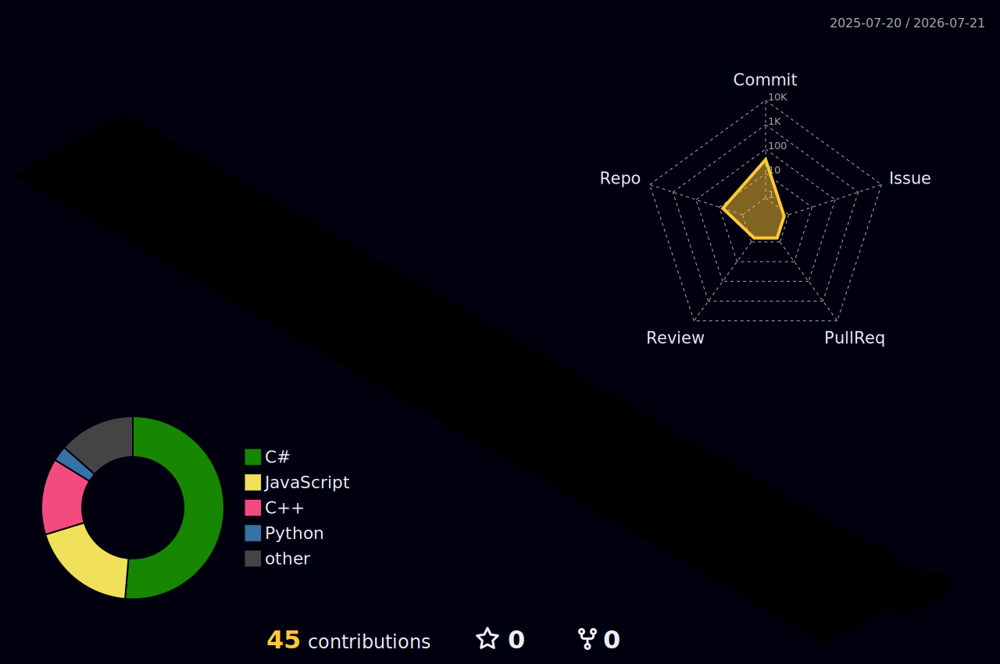

<p align="center">
  
</p>

<p align="center">
  <a href="https://github.com/hessoruby">
    
  </a>
</p>

<p align="center">
  
  
  
</p>

<br />

<table align="center">
  <tr>
    <td>
      <pre>
$ cat profile.txt

name       : harsh
working_on : the portfolio, again
timezone   : india / utc+5:30
status     : around, probably
      </pre>
    </td>
  </tr>
</table>

<br />

### `~/stack`

<p align="center">
  
</p>

<br />

### `~/projects`

<table>
  <tr>
    <td width="50%" valign="top">
      <code>01</code>
      <a href="https://hessoruby.vercel.app"><strong>hessor</strong></a>
      <br /><br />
      <sub>the portfolio I keep taking apart and putting back together.</sub>
      <br /><br />
      <code>TypeScript · React · Three.js</code>
    </td>
    <td width="50%" valign="top">
      <code>02</code>
      <a href="https://github.com/hessoruby/SpacePotato"><strong>SpacePotato</strong></a>
      <br /><br />
      <sub>a small Unity rocket game with obstacles, crashes, and landing pads.</sub>
      <br /><br />
      <code>Unity · C#</code>
    </td>
  </tr>
  <tr>
    <td width="50%" valign="top">
      <code>03</code>
      <a href="https://github.com/hessoruby/ZeroContact"><strong>Zero Contact</strong></a>
      <br /><br />
      <sub>a cube game where touching anything is basically the whole problem.</sub>
      <br /><br />
      <code>Unity · C#</code>
    </td>
    <td width="50%" valign="top">
      <code>04</code>
      <a href="https://github.com/hessoruby/gon-compressor"><strong>Gon Compressor</strong></a>
      <br /><br />
      <sub>a file compression experiment using Huffman coding and LZW.</sub>
      <br /><br />
      <code>Java · Maven</code>
    </td>
  </tr>
</table>

<br />

### `~/currently-exploring`

```text
lab-notes/
├── 3d environments       arranging
├── interactive web       testing
└── small game systems    probably breaking
```

<br />

### `~/telemetry`

<p align="center">
  
  
</p>

<br />

### `~/activity-map`

<p align="center">
  
</p>

<br />

### `~/contact`

<p align="center">
  <a href="https://github.com/hessoruby">
    
  </a>
  <a href="https://hessoruby.vercel.app">
    
  </a>
</p>

<br />

<p align="center">
  <sub>back to whatever I was fixing.</sub>
</p>

<!-- end -->
